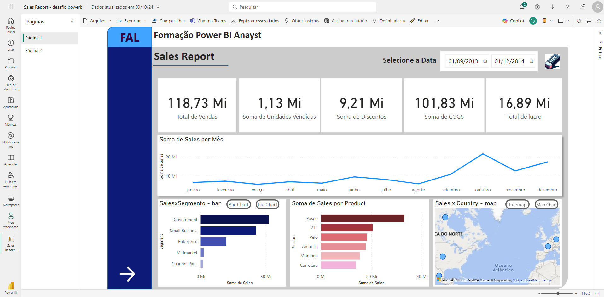

# Sales Report Power BI Sample

Este repositório contém um exemplo de relatório de vendas desenvolvido no Power BI. O objetivo deste projeto é demonstrar como criar visualizações interativas e realizar análises de dados de vendas, oferecendo insights sobre o desempenho da empresa.

## Visão Geral

O relatório de vendas inclui as seguintes funcionalidades:

- **Análise de Vendas Mensais**: Visualize a evolução das vendas ao longo dos meses.
- **Comparação de Desempenho**: Compare o desempenho de diferentes produtos e regiões.
- **Métricas de Desempenho (KPIs)**: Monitoramento de KPIs como receita total, quantidade de vendas e taxa de crescimento.
- **Tabelas Dinâmicas**: Explore os detalhes das vendas com opções de drill-down.
- **Gráficos Interativos**: Interaja com os dados para uma análise mais profunda e personalizada.

## Publicação no Power BI

## Estrutura do Arquivo

- **Sales_Report_PowerBI_Sample.pbix**: O arquivo do Power BI que contém todas as visualizações e cálculos realizados.
  
## Como Usar

1. Faça o download do arquivo `Sales_Report_PowerBI_Sample.pbix`.
2. Abra o arquivo no Power BI Desktop.
3. Explore as visualizações interativas e os relatórios.
4. Conecte a um conjunto de dados personalizado se desejar utilizar dados próprios.

## Requisitos

- **Power BI Desktop** (versão mais recente).
- **Conjunto de dados de vendas** (opcional).

## Principais Insights

- **Tendências de Vendas**: Identifique períodos de maior e menor desempenho.
- **Top Produtos e Regiões**: Descubra quais produtos ou regiões impulsionam as vendas.
- **Análise de Crescimento**: Veja como as vendas estão evoluindo ao longo do tempo.

## Contribuições

Contribuições são bem-vindas! Se você deseja melhorar o projeto ou adicionar novas funcionalidades, sinta-se à vontade para abrir um pull request ou uma issue.

## Licença

Este projeto está licenciado sob a Licença MIT.
